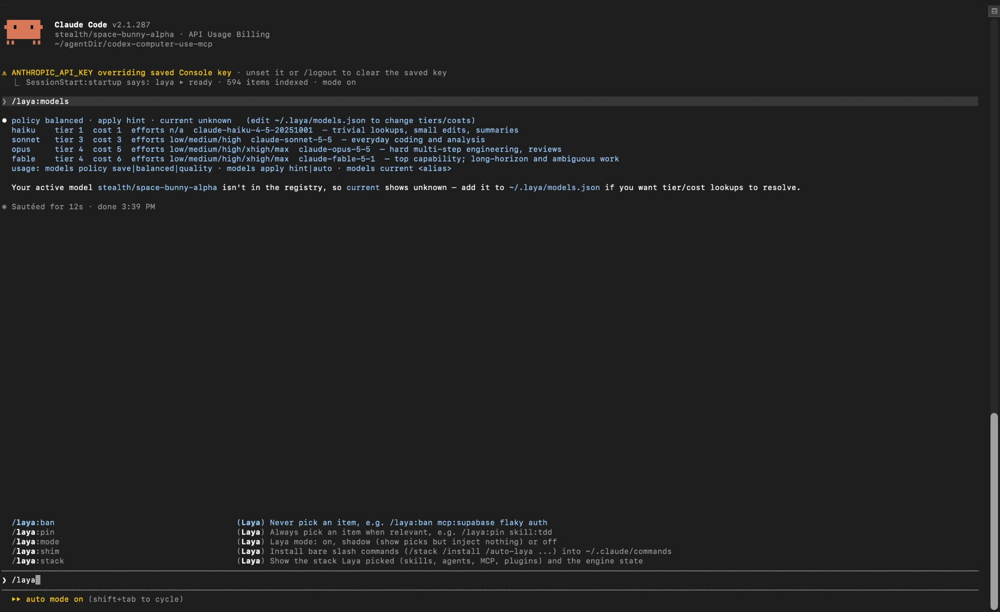

# Claude's Laya — the meta-plugin that chooses (and installs) your Claude Code stack

<div align="center">
  
</div>

Before **every prompt**, Laya's decision engine picks the best skills, agents, MCP servers and plugins from everything you have (and everything you *could* have), tells you what it picked, and hands Claude a compact decision. It researches and installs better tools on request, and learns from failures in a universal `~/.laya/laya.md`.

<div align="center">
  
</div>

```
you ▸ build a react dashboard with supabase auth
laya ▸ frontend_ui·d3 │ skills: ui-ux-pro-max, web-design-guidelines │ agents: UI-UX-DESIGNER │ ＋install: supabase → /laya:install │ laya·mps 640ms
```

## Install (that is all)

```bash
claude plugin marketplace add <path-or-github-url-of-this-repo>
claude plugin install laya@laya-marketplace
```

On the next session start Laya sets itself up in the background — no commands to run:

1. private Python venv in `~/.laya/venv` (uses `uv` if present, else `python3 -m venv`)
2. `pip install laya` + downloads the English checkpoint into the shared Hugging Face cache (**one time, ~1–2 GB**, reused if you already have it)
3. starts a warm daemon (unix socket, user-only) and indexes your registry
4. installs the bare slash commands `/stack`, `/install`, `/auto-laya` into `~/.claude/commands`

Until that finishes Laya runs in **lexical mode** (BM25) so nothing ever blocks. Opt out of the download with `LAYA_NO_AUTOSETUP=1`. Needs `node` ≥ 18 (you have it if you have Claude Code's npm tooling); `uv` or `python3` ≥ 3.10.

## What you see

Every prompt prints one `laya ▸` line (what was picked, what to avoid, what to install, engine + latency). `/laya:verbose quiet|normal|full` changes it; `full` adds scores and flags. SessionStart, failures (`recorded failure: mcp:x → laya.md`), auto-laya re-picks and turn outcomes print too.

## Commands

| command | what it does |
|---|---|
| `/install <task>` (`/laya:install`) | scout → vet → install the best skills/agents/plugins/MCP for a task |
| `/stack` (`/laya:stack`) | the stack Laya picked + engine state |
| `/auto-laya on\|off` | mid-task re-checks: tools failing twice, every 12 tool calls |
| `/laya:status` · `doctor` · `explain` · `ledger` | health, diagnostics, why-this-pick, laya.md summary |
| `/laya:learn` · `pin` · `ban` | teach laya.md by hand |
| `/laya:mode on\|shadow\|off` | shadow = show picks, inject nothing (calibrate first) |
| `/laya:models` | model + effort routing: list, `policy save\|balanced\|quality`, `apply hint\|auto`, `current <alias>` |
| `/laya:verbose` · `policy` · `refresh` · `statusline` | knobs |
| `/laya:adapt codex\|gemini\|generic` | use Laya in other agents |
| `/laya:export` | decisions + outcomes → Laya fine-tune dataset |

`/stack`, `/install`, `/auto-laya` are also installed bare. Other bare names (`/status`, `/mode`…) are deliberately not, they would shadow built-ins.

## How a decision is made

```
prompt ─▶ gate (skip slash-commands, trivial, follow-ups)
       ─▶ registry (skills, agents, commands, MCP, plugins; installed + marketplaces + official catalog)
       ─▶ hybrid shortlist: BM25  ∪  Laya-encoder embeddings (≤9 per kind)
       ─▶ Laya, one forward pass: domain · difficulty · needs_install/research · sensitive · pick_skill/agent/mcp/plugin
       ─▶ blend: 0.3·lexical + 0.2·embedding + 0.5·Laya  (Laya says "none fits" ⇒ lexical evidence only)
          + laya.md history (wins ↑, fails ↓, bans, pins) − token cost
       ─▶ decision JSON (templates/decision.schema.json) ─▶ systemMessage (you) + additionalContext (Claude, ≤300 tokens)
```

Laya answers in ~0.6 s warm (Apple GPU), 10 options per question because the checkpoint's temperature is uncalibrated beyond that. It is zero-shot, so its picks are *blended* with lexical evidence and your history; the more you use it, the more `decisions.jsonl` you can fine-tune on (`docs/FINETUNE.md`).

## laya.md — the universal memory

`~/.laya/laya.md` (override `$LAYA_HOME`; per-project overlay `./.laya/laya.md`). A markdown ledger — `item | wins | fails | last | verdict | until | note` — plus free-text notes. Failures are logged automatically by a hook (MCP/skill/agent) and by Claude via the always-on `laya-memory` skill. 2 fails ⇒ `warn`, 5 fails ⇒ 14-day `ban`; wins heal. Secrets are redacted on write. Edit it by hand any time.

## Model + effort routing

Each decision also picks the **cheapest model that is capable enough** from `~/.laya/models.json` (defaults: haiku, sonnet, opus, fable) and an effort level, shown as `model: sonnet/high (−40% tokens)`. Claude is told to delegate trivial subtasks to the cheapest model and hard reviews to the strongest via the Agent tool's `model` param. A model with failures in laya.md (`model:<alias>`) is skipped. Tiers and costs are **relative guesses, not prices**: edit the file to match your plan. A hook cannot switch the live session model; with `/laya:models apply auto` Claude switches it itself when session tools (desktop app) exist, otherwise it suggests `/model` and `/effort`. Changes take effect from the next turn.

## Research & install

`laya-conductor scout "<task>"` searches **local marketplaces + Anthropic's catalog, `npx skills find`, GitHub (`gh`), the MCP registry**. `vet` statically scans a repo (hooks, install scripts, `curl | sh`, credential access, prompt-injection text) before any code runs. Policy (`/laya:policy`): `trusted` (default) installs official/vendor sources automatically and asks for everything else; `ask` always asks; `off` never. Trust is computed by the CLI, never from what the model claims; high-risk repos are refused outright. After installing: `/reload-plugins`; OAuth/API keys are yours to provide.

## Other agents

Codex and Gemini CLI speak the same `hookSpecificOutput.additionalContext` protocol: `/laya:adapt codex|gemini` wires their hook config to the same engine through a stable launcher (`~/.laya/bin/laya-conductor`). Agents without hooks get the MCP server (`laya_decide`, `laya_learn`, `laya_search`, `laya_scout`) + an `AGENTS.md` rule (`adapt generic`). Codex hooks are experimental upstream; Gemini timeouts are in ms.

## Privacy & safety

Everything runs locally; prompts never leave your machine (the only network use is the one-time checkpoint download and explicit scout/install). The daemon socket is `chmod 600`. Registry text from third-party marketplaces is treated as untrusted: length-capped, injection phrases stripped, and never injected into Claude's context (only names are). Every hook is fail-open (always exits 0 with valid JSON) so Laya can never block a prompt.

## Files

`~/.laya/`: `laya.md` · `registry.json` · `decisions.jsonl` · `state.json` · `emb.npz` · `venv/` · `bin/laya-conductor` · `laya.log` · `setup.json`

## Develop

```bash
node tests/selfcheck.js            # 14 checks, offline, isolated temp dirs (golden prompts in evals/golden.json)
claude plugin validate .
claude --plugin-dir . ...           # try it without installing
```
Uninstall: `claude plugin uninstall laya`, `laya-conductor daemon-stop`, `rm -rf ~/.laya` (and the 3 files marked `<!-- laya-shim -->` in `~/.claude/commands`).

## License

This project is licensed under the **MIT License** — see [LICENSE](LICENSE) for details.

---

Built on [Laya](https://github.com/NandhaKishorM/laya) (Apache-2.0) by Nandha Kishor M. This plugin is an independent integration.
